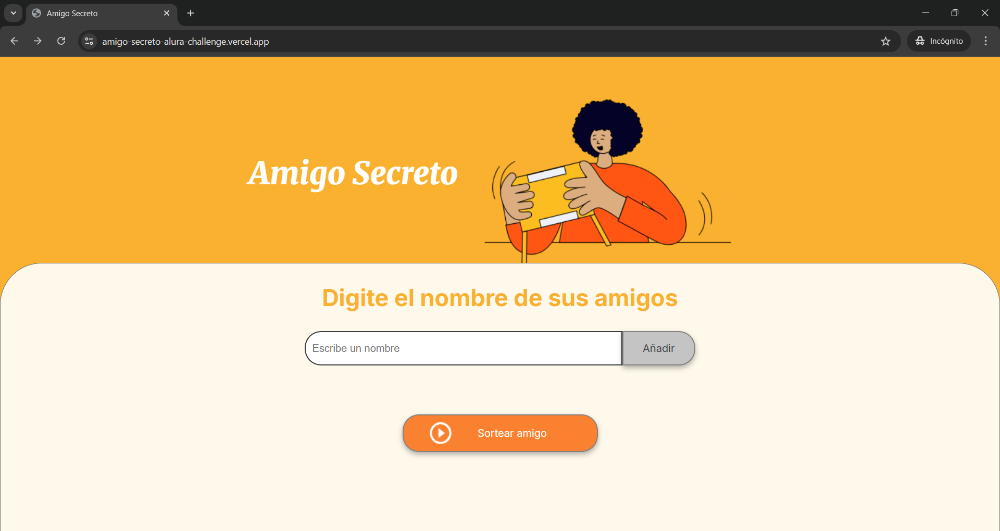
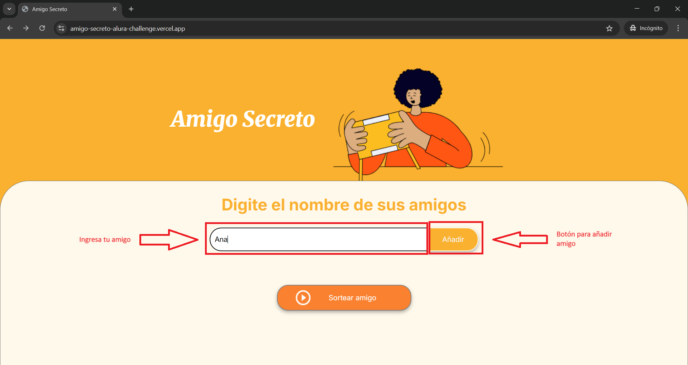
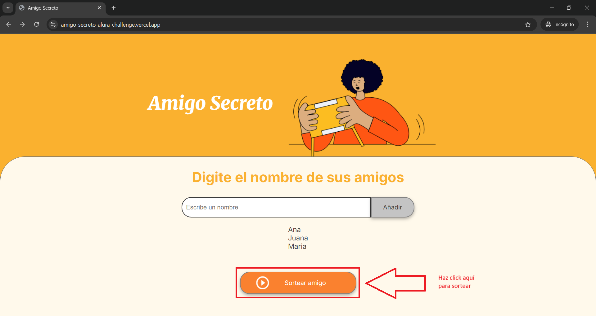
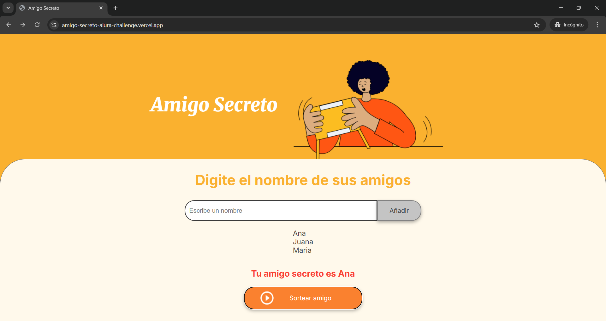

# Bienvenido!!💻👩‍💻
Bienvenido a mi repositorio del <b>Challenge de Amigo Secreto</b> de alura latam. Este es un proyecto desarrollado como parte del Alura Challenge, que consiste en una aplicación web para organizar juegos de Amigo Secreto de manera sencilla e intuitiva.

## Acceso:

Podras Acceder al proyecto de dos formas:

1. Enlace de Github Pages

Para acceder mediante Github Pages, deberas seguir el siguiente enlace:

https://aleinxdot.github.io/amigo-secreto--AluraChallenge/

2. Enlace de Vercel

Para acceder mediante Github Pages, deberas seguir el siguiente enlace:

https://amigo-secreto-alura-challenge.vercel.app/

Tambien podras clonar el proyector usando los siguientes comandos en git bash.

```
git clone https://github.com/AleinxDot/amigo-secreto--AluraChallenge.git
cd amigo-secreto--AluraChallenge
```
## ¿Cómo usar la aplicación?

Primero debe de ingresar usando cualquiera de los links detallados en la parte superior.

Al dar click en enlace se abrira una pestaña en el navegador con la siguiente informacion:


Para agregar un amigo tendremos que rellenar su nombre en la siguiente casilla. Y luego darle al boton "Añadir" que se encuentra en su costado:


Una lista de con el nombre de tus amigos aparecera en la parte inferior de la casilla. Recuerda: Deberas añadir por lo menos dos amigos para poder realizar el sorteo.

Una vez hayas terminado de llenar tu lista de amigos, haz click en el boton "Sortear Amigo":


Finalmente, aparecera el nombre de tu amigo secreto resaltado en un color naranja.

